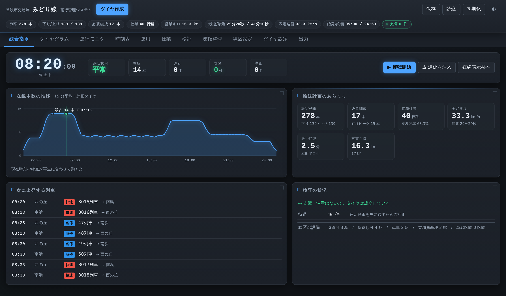
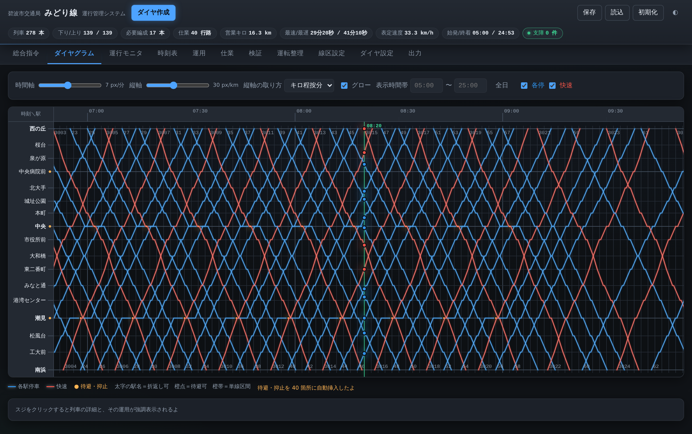
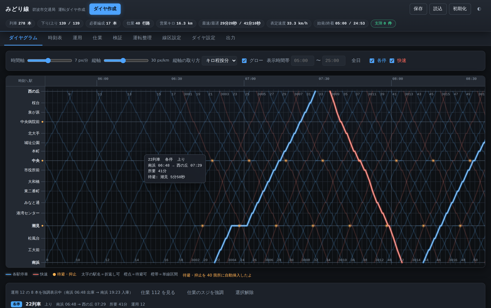
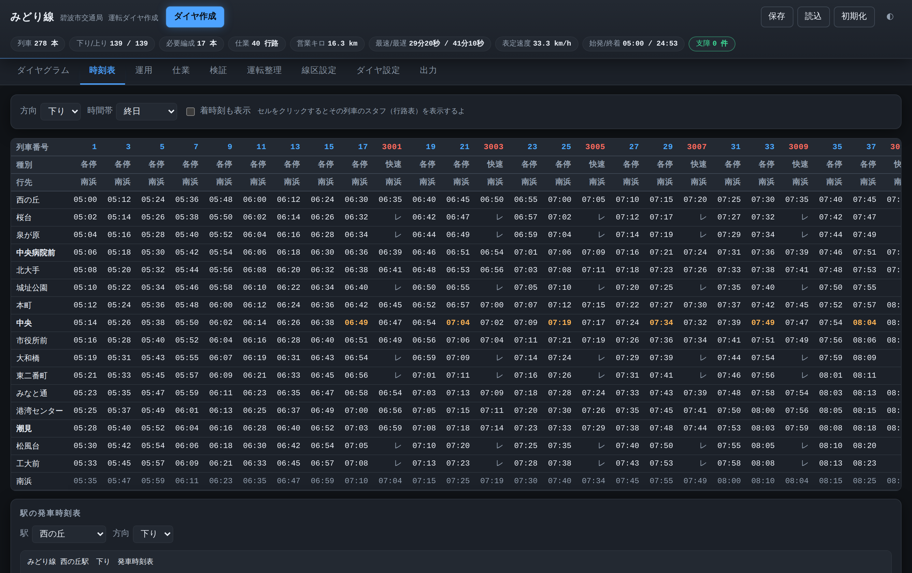
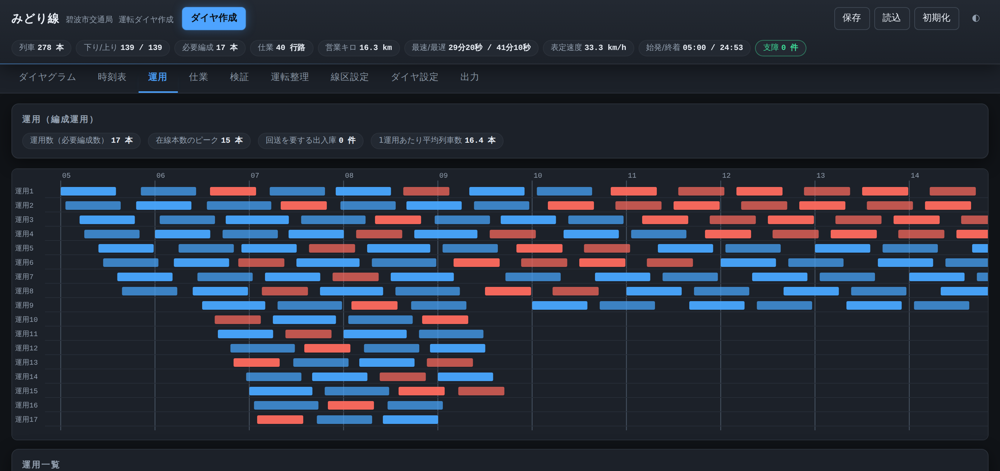
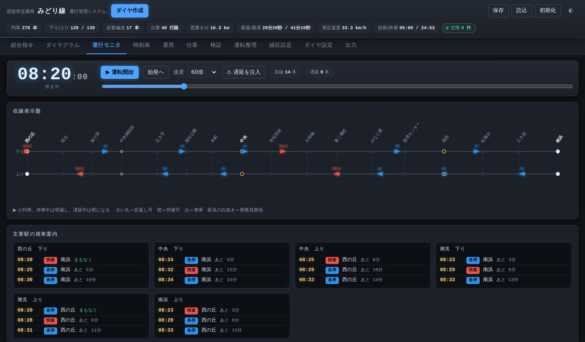
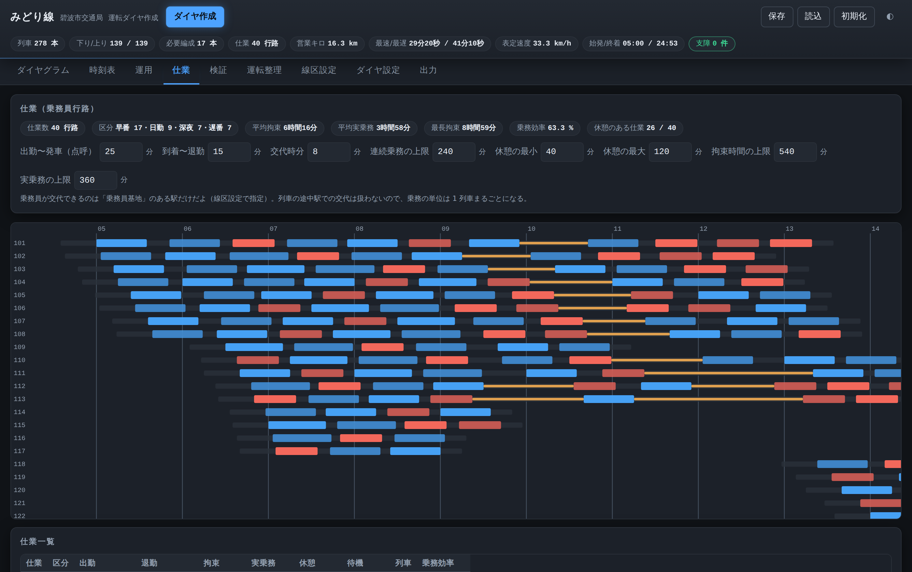
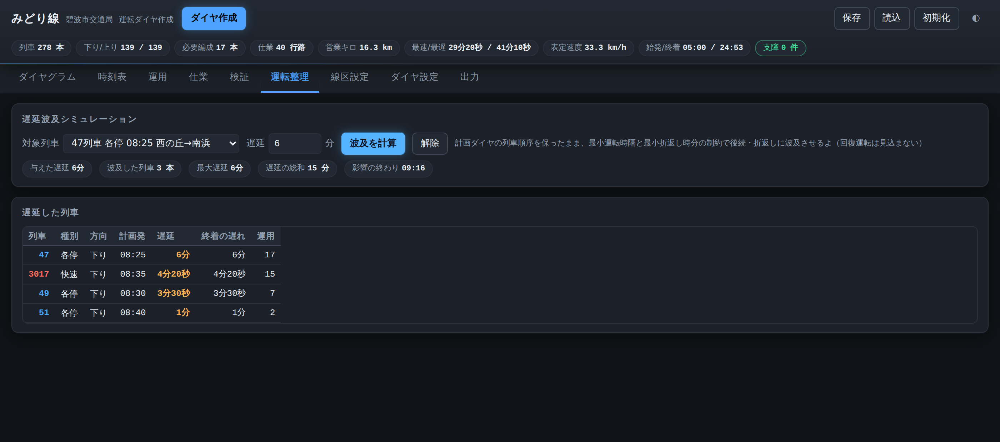

# 運行管理システム（運転ダイヤ作成）

地方都市の地下鉄（17 駅・16.3km・単純な線形の路線）を想定した、**運転ダイヤの作成・検証ツール**です。
運行管理システムの計画系機能——線区諸元の設定、パターンダイヤの自動生成、ダイヤグラム（列車ダイヤ）の作図、
時刻表の出力、車両運用の組成、支障の検証、遅延波及のシミュレーション——を 1 画面にまとめています。

ビルド不要・依存ライブラリなしの素の HTML / CSS / JavaScript です。`index.html` をブラウザで開けば動きます。





画面は運転指令室の表示盤を思わせる暗い配色を既定にしています（右上のボタンで明るい表示にも切り替えられます）。
スジは「淡いハロー・本体・1px の芯」の 3 枚重ねで描いていて、選ぶとその運用だけが浮かび上がります。
ダイヤを作り直すと、作図面を左から掃引しながらスジが引かれます。



## できること

| 画面 | 内容 |
| --- | --- |
| **総合指令** | 一枚で全体をつかむ画面。運転状況・在線・遅延・支障のランプ、在線本数の推移（15 分平均・現在時刻つき）、輸送計画のあらまし、次に出発する列車、検証の状況 |
| **運行モニタ** | 模擬時刻を進めて在線列車を動かす表示盤。列車の光点、駅の発車案内、走行中の列車への遅延注入 |
| **ダイヤグラム** | 横軸＝時刻・縦軸＝駅（キロ程按分／等間隔）のスジ図。ズーム、時間帯の絞り込み、種別の表示切替、スジのクリックで列車詳細とその運用の強調表示 |
| **時刻表** | 行＝駅／列＝列車のグリッド時刻表（通過は「レ」）、着発の切替、駅ごとの発車時刻表（時刻表冊子の体裁）、1 列車のスタフ（行路表） |
| **運用** | 折返し接続で組んだ編成運用のガントチャートと一覧。必要編成数・在線本数のピーク・出入庫の要否 |
| **仕業** | 乗務員の行路（出勤・点呼／乗務／交代／休憩／退勤）の組成。拘束時間・実乗務・連続乗務・休憩の条件を画面で変えながら、仕業数と乗務効率のつり合いを見る。ガント、一覧、1 仕業の行路表 |
| **検証** | 続行時隔・追い抜き支障・単線支障・折返し設備／折返し時分・出入庫を判定し、支障／注意／情報の 3 段階で一覧。クリックでダイヤグラムの該当時刻へジャンプ |
| **運転整理** | 任意の列車に遅延を与えたときの後続・折返しへの波及をシミュレーションし、遅延ダイヤをダイヤグラムに重ねて表示 |
| **線区設定** | 駅（駅名・キロ程・停車時分・折返し可／待避可／車庫）と駅間（基準運転時分・単線）の編集、駅の追加・削除 |
| **ダイヤ設定** | 列車種別（名称・色・号数帯・停車駅）、時間帯パターン（運転間隔と 1 巡の構成）、計算パラメータ |
| **出力** | ダイヤファイル(JSON)、時刻表 CSV（上り／下り）、列車一覧 CSV、運用 CSV、仕業 CSV、行路表(txt)、ダイヤグラム SVG |

<p align="center">
  
  
</p>

## デモの流れ

1. 開くと起動シーケンスのあと、**総合指令**にサンプル線区のダイヤが出ます（278 本・17 編成・40 行路）。
   在線本数の推移で朝夕のピークが読め、右のタイルに必要編成・仕業・表定速度・最小運転時隔が並びます。
2. **ダイヤグラム** … 掃引しながらスジが引かれます。スジをクリックすると、その列車が属する運用の 27 本が白い芯で浮かび上がります。
3. **運行モニタ**（または総合指令の「運転開始」）… 押すと模擬時刻が 60 倍速で進み、在線表示盤の上を列車の光点が動きます。ダイヤグラムに切り替えると、現在時刻の縦線と在線列車の光点が一緒に動きます。
4. **遅延を注入** … いま走っている列車の 1 本に 5 分の遅れを与えます。総合指令の運転状況が「乱れ」に変わり、その列車と波及先が橙に変わり、駅の発車案内の時刻がずれ、ダイヤグラムには遅延ダイヤが破線で重なります。「復旧」で計画ダイヤに戻ります。
5. **検証・仕業** … 支障の一覧や、乗務員の行路とその勤務条件を見せられます。条件を変えるとその場で組み直されます。



## 使い方

```bash
# そのまま開く
open index.html            # ローカルファイルのままで動きます

# ローカルサーバで開く場合
npm start                  # http://localhost:8080

# テスト（Node.js 18+ / 依存なし）
npm test

# 1 枚の HTML にまとめる
npm run build              # dist/dia-editor.html
```

設定は自動的にブラウザの localStorage へ保存されます。`保存` で JSON として書き出し、`読込` で復元できます。

## 初期データ（サンプル線区）

架空の「碧波市交通局 みどり線」を収録しています。

- 17 駅・16.3km・全線複線、西の丘（車庫）〜南浜（車庫）
- 折返し可：西の丘・中央・潮見・南浜／待避可：中央病院前・中央・潮見
- 種別：各駅停車（所要 35 分 10 秒）、快速（7 駅通過・所要 29 分 20 秒）
- 時間帯パターン：早朝 12 分 → 朝ラッシュ 5 分（各停・快速・各停）→ 昼間 10 分 → 夕ラッシュ 6 分 → 夜間 10 分 → 深夜 15 分
- 乗務員基地：西の丘・中央・南浜
- 生成結果：278 本（下り 139 / 上り 139）、必要編成数 17 本、仕業 40 行路、支障 0 件

## 配色について

列車種別の色（各停 `#2e93ec` / 快速 `#ef5347`）は、暗い作図面と明るい地の双方で
明度帯・彩度・コントラスト、および P 型・D 型・T 型色覚での分離（ΔE 24 以上）を確認したものです。
スジは色だけでなく向き（右下がり＝下り／右上がり＝上り）と列車番号でも判別できます。

## 計算のしくみ

### 運転時分

駅間には「両端とも停車する列車の**基準運転時分**」を持たせます。通過する列車は加減速の損失が戻るぶん、
片端あたり `passSave`（既定 15 秒）だけ短縮します。両端とも通過なら 30 秒短縮です。
停車時分は駅ごとに持ち、時刻は `roundTo`（既定 5 秒）単位に丸めながら積み上げます。

```
着(次駅) = 発(当駅) + 基準運転時分 − 通過補正
発(次駅) = 着(次駅) + 停車時分
```

### パターンダイヤの生成

時間帯ごとに `開始〜終了`・`運転間隔`・`1 巡の構成`（種別と運転区間の並び）を設定し、
開始時刻から間隔ごとに構成を順に繰り返して列車を発生させます。上りは全体を `upOffset` だけずらします。
列車番号は種別ごとの号数帯に、下り＝奇数・上り＝偶数で採番します。

### 待避・抑止の自動挿入

速い列車が先行列車に最小運転時隔まで詰めてしまう箇所を探し、**その手前の待避可能駅で先行列車を抑止**します。
抑止すると後ろへ影響が伝わるため、収束するまで（最大 8 回）繰り返します。
待避駅がない、または抑止が 15 分を超えるなど解決できない場合は、その旨を注記として返します。
純粋な時隔不足（後続のほうが速くない）は待避では解決しないので、運転間隔の見直しを促します。

### 車両運用の組成

到着した列車を、同じ駅から最小折返し時分以降に発車する未割当列車へ順に接続する貪欲法です
（最早発車を優先）。組成されたチェーンの数がそのまま必要編成数になります。
始端・終端が車庫でない運用には、出入庫回送が要る旨を情報として出します。

### 検証

| 種別 | 判定 |
| --- | --- |
| 続行時隔 | 同一方向の続行列車が各駅で最小運転時隔を割り込んでいないか |
| 追い抜き支障 | 列車の順序が入れ替わる地点が待避可能駅か、かつ先行列車に待避の停車時分があるか |
| 単線支障 | 単線区間を 2 本以上が同時に占有していないか（対向は「正面支障」） |
| 折返し | 折返し設備のない駅を始発・終着にしていないか、折返し時分が足りているか |
| 出入庫 | 車庫のない駅で運用が始まる／終わる場合の回送の要否 |
| 拘束時間・乗務時間・連続乗務 | 仕業が乗務員の勤務条件の上限を超えていないか |
| 仕業 | 乗務員基地のない駅で出勤・退勤していないか、長い乗務に休憩が確保されているか |

### 乗務員仕業の組成

「運用」が編成の一日の動きなのに対し、「仕業」は乗務員ひとりの一日の勤務です。
出勤・点呼から始まり、列車への乗務と交代・休憩をはさんで、退勤で終わります。

乗務員が交代できるのは**乗務員基地**のある駅だけです。列車の途中駅での交代は扱わないので、
乗務の単位は 1 列車まるごとになります。到着した駅から、交代時分（同じ編成に乗り続けるなら折返し時分）
以降に発車する未乗務の列車へ順に接続していき、次のいずれかに引っかかったところで仕業を閉じます。

- 拘束時間（出勤〜退勤）が上限を超える
- 実乗務時間の合計が上限を超える
- 連続乗務が上限に達し、その駅が基地でないか、規定の休憩が取れる列車がない

連続乗務の上限に達した駅が基地なら、休憩（既定 40 分〜2 時間）をはさんで乗務を続けます。
基地でない駅で終わってしまう場合は、基地へ着く列車に乗って帰所します。それも組めない場合は
「添乗で帰所する必要がある」と警告します。

条件は画面上で変えられます。たとえば拘束時間の上限を 9 時間から 7 時間に締めると、
サンプルダイヤでは仕業数が 40 → 49 に増えます。乗務効率（実乗務 ÷ 拘束）は 63.3% → 61.9% と、
むしろわずかに下がります——1 仕業が短くなるぶん、点呼と後処理が占める割合が上がるためです。



### 遅延波及シミュレーション

計画ダイヤ上の順序（待避による追い抜きを含む）を保ったまま、最小運転時隔と最小折返し時分で遅延を伝播させます。
各駅の着発を**計画時刻の早い順に 1 度だけ確定**させていくので、時刻は前へしか動かず、
待避で前後関係が入れ替わる列車どうしが押し合って発散することがありません。

```
着 = max( 計画の着 + 与えた遅延, 前駅の発 + 計画の走行時分 )
発 = max( 計画の発 + 与えた遅延, 着 + 計画の停車時分,
          同じ駅・同じ方向の直前列車 + 最小運転時隔,
          （始発なら）折返し元の着 + 最小折返し時分 )
```

回復運転は見込みません（運転時分・停車時分に余裕時分を設定していないため）。
朝ラッシュ帯の走行中の列車に 5 分の遅れを与えると、サンプルダイヤでは 3〜6 本に波及し、1 時間ほどで収まります。



## ファイル構成

```
index.html            画面の骨組み
css/style.css         スタイル（ライト／ダーク両対応）
js/core/time.js       時刻ユーティリティ（24 時を超える時刻を扱う）
js/core/line.js       線区モデルとサンプルデータ
js/core/schedule.js   ダイヤ生成・待避の自動挿入
js/core/operation.js  車両運用の組成
js/core/crew.js       乗務員仕業の組成
js/core/validate.js   支障の検証
js/core/disrupt.js    遅延波及シミュレーション
js/core/exporters.js  CSV / JSON / 発車時刻表の出力
js/ui/diagram.js      ダイヤグラムの作図（SVG）・現在時刻カーソル
js/ui/monitor.js      運行モニタ（在線表示盤）
js/ui/views.js        時刻表・運用・検証の各ビュー
js/ui/editors.js      線区諸元・種別・パターンのエディタ
js/ui/app.js          状態管理と画面の取りまとめ
test/core.test.js     コアロジックのテスト（node --test）
tools/build-single.js 1 枚の HTML へのバンドル
```

`js/core/*` はブラウザと Node.js の双方から読める形にしてあるため、UI なしでロジックだけを試せます。

```js
const Line = require('./js/core/line.js');
const Sch  = require('./js/core/schedule.js');
const line = Line.defaultLine();
const { trains } = Sch.buildTimetable({
  line, types: Line.defaultTypes(),
  patterns: Line.defaultPatterns(line), params: Line.defaultParams()
});
console.log(trains.length);   // 278
```

## 割り切っているところ

- 線形の 1 路線のみを扱います（分岐・支線・直通運転・環状線は対象外）。
- 列車ごとの手修正（個別の時刻変更・停車駅変更）はできません。ダイヤはパターン設定から都度生成します。
- 仕業は 1 日ぶんの行路までで、複数日にわたる交番（行路の並べ方）や、泊まり勤務・明け番は扱いません。
- 乗務員の交代は乗務員基地のある駅に限られ、列車の途中駅での交代は組めません。
- 運転時分に余裕時分（回復運転のための余裕）を持たせるしくみはありません。
